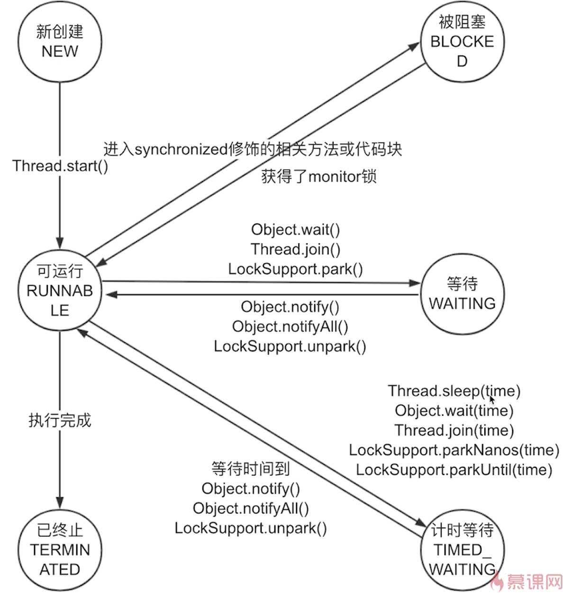
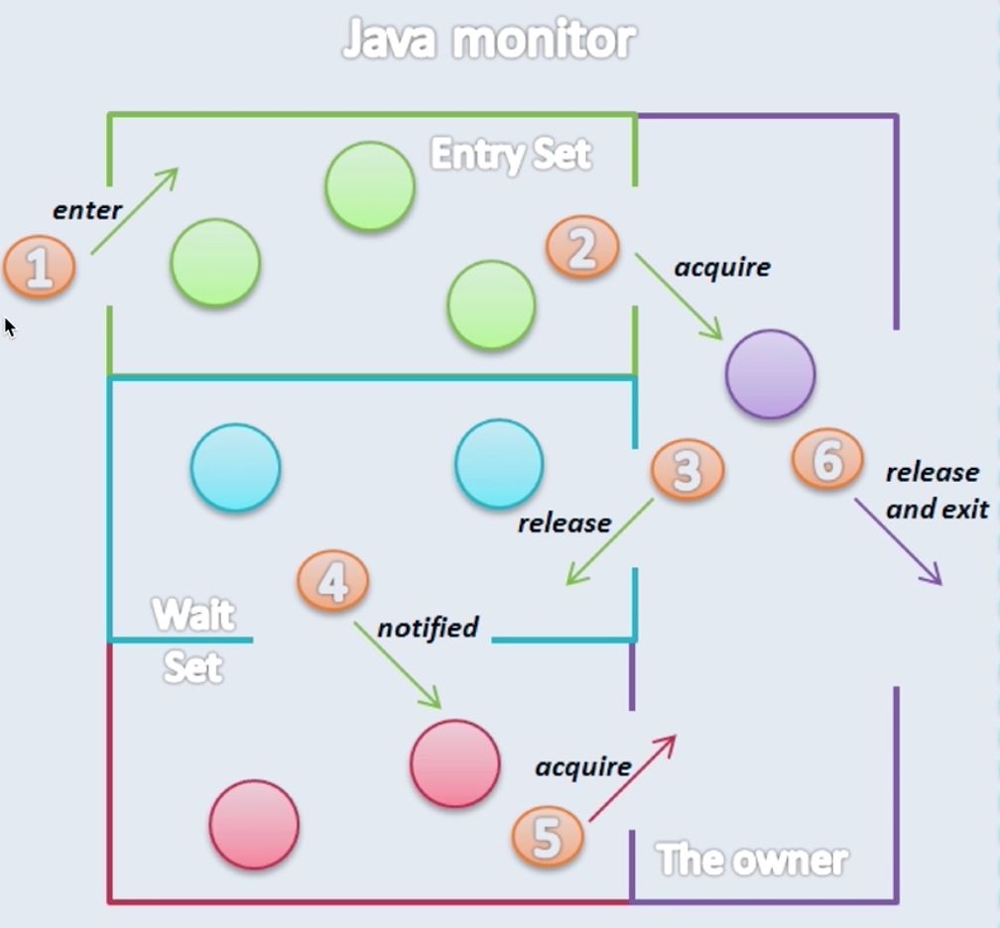

+++
author = "augenye"
title = "多线程基础知识"
date = "2021-08-01"
categories = [
    "服务端"
]
tags = [
    "Java","多线程"
]

+++
## 基础概念

### 进程和线程

是为了**解决资源分配**的问题,计算资源（CPU），进程（内存），进程（文件），进程会拥有除了计算资源之外的所有资源。虽然操作系统里说：进程是计算机资源分配的最小单位。但是现在已经不太对了，计算资源现在不分配给进程，而是直接分配给线程资源，因为现在进程哪不同任务需要分时，进程创建时就创建主线程，创建线程需要（1. 一段程序 2. 入口指令的内存地址），线程共享进程的内存，但是这是受限于程序语言，操作系统并为对此做限制。

* 进程：线程的容器，系统资源会分配给进程，是程序的执行副本，例如多个APP，启动多个服务就是启动了多个线程。
* 线程：被称为轻量级的进程，在linux中线程的别名就叫做LWP（light-weight-process）。
  * 线程是执行单位，线程不拥有资源，线程计算资源，那为什么threadloca看起来又是线程资源呢，threadlocal是进程给所有线程看到的共享资源空间，获取的时候会以当前线程为key查询相应的的资源

用户级线程：进程在创建的时候会创建主线程，系统资源是分配给进程的，如果都是用户级线程，那么他们共享的是主线的时间片或资源。系统调度资源只涉及到了进程。

内核级线程：线程分配在内核态，由系统来进行调度。

### 上下文切换

任务执行一个时间片后会切换到下一个任务。但是在切换之前会保存上一个任务的状态，以便下次切换回这个任务时，可以再加载这个任务的状态。

如何减少上下问切换？

1. 无锁并发编程，多线程竞争锁会引起上下文切换，所以多线程处理数据，可以用一些，方法来避免使用锁，例如，将数据的ID按照hash算法取模，不同的线程处理不同段的数据。
2. CAS算法：compare  and swap，比较再赋值
   1. ABA：版本号解决，时间戳解决
3. 使用最少线程，避免创建不必要的线程，例如使用线程池。
4. 协程，单线程里实现多任务调度，并在单线程里维持多个任务的切换。

### 死锁：资源冲突造成的互相等待

如何避免死锁：

1. 避免一个线程同时获取多个锁
2. 避免一个线程在锁内占用多个资源，尽量保证每个锁只获取一个资源
3. 尝试使用定时锁，自动释放
4. 对于数据锁，加锁和解锁必须在一个数据库连接里，否则会出现解锁失败的情况

### 同步：执行同步，数据同步

- 执行同步：多个参与方，多个线程，互相等待执行后续操作
- 数据同步：缓存和存储之间的同步，不同机房数据库的同步

###  monitor的实现

每一个对象都关联一个monitor，解决了每一个对象都可以上锁，不用再定义锁变量，线程抢占锁，就是抢占monitor，monitor内部实现等待集合，没有竞争到锁的线程梓萱失败后，会在等待集合中休眠

能力汇总：JVM的monitor指令

1. monitorenter：获取锁，成功进入临界区，失败：自旋->休眠->waitset
2. 临界区
3. monitorexit：唤醒

### volatile

volatile的实现原则

1. Lock前缀指令会引起处理器缓存写回到内存当中
2. 一个处理器缓存回到内存会导致其他处理器的缓存无效（缓存一致性协议）

### Synchronized
synchronized的表现形式
1. 对于普通同步方法，锁的是当前实例的对象
2. 对于静态同步方法，锁事当前类的class对象
3. 对于同步方法块，锁事Synchronized括号里配置的对象
#### 锁升级

为了减少获得锁和释放锁带来的性能消耗而引入的偏向锁和轻量级锁，以及锁的存储结构和升级过程

1. 偏向锁：大多数情况下，锁不仅不存在多线程竞争，而且总是由同一线程多次获得，为了获取锁的代价更低从而引入了偏向锁，当一个线程进入同步代码块并获取锁的时候，会在对象头和栈帧中的锁记录里存储偏向锁的线程ID、以后该线程进入代码块的时候不需要再次竞争，而是判断mark_word里标注的偏向锁id是否指向当前线程，如果不是，则再看一下当前mark_work，判断一下当前是否为偏向锁，如果未设置，则使用CAS竞争锁，如果设置了，则尝试使用CAS将当前对象头的偏向锁指向当前线程。解锁：出现竞争就会出现释放锁
2. 自旋锁：偏向锁竞争失败，升级为自旋锁，尝试自旋获取锁，

## 线程状态

## 线程中断

### Park & UnPark🤨

`Park`暂停当前线程，`UnPark`恢复某个线程的执行，可以指定线程暂停和恢复。

它们与`wait和notify`不同的是，前者需要配合`Object Monitor`使用，而`unpark`不必

`wait & notify & notifyAll`使用必须先拥有`monitor`，属于`Object`类

### 如何停止线程😫

使用`interrupt`来请求，停止线程，需要请求方和被停止方，子方法被调用方相互配合，中断检查再执行。`stop`和`suspend`已废弃，`volatile`不适合用来做中断控制，无法处理长时间阻塞

- 作为被停止方：每次循环中或者适时检查中断信号，并且在可能抛出InterrupedException的地方处理该中断信号；
- 请求方：发出中断信号；
-  子方法调用方（被线程调用的方法的作者）要注意：优先在方法层面抛出InterrupedException，或者检查到中断信号时，再次设置中断状态

### 用volatile设置boolean标记位有什么问题🧐

首先，这种做法是错误的，在某些情况下虽然可用，但是在一些情况下会存在严重问题。

如果我们遇到了线程长时间阻塞，例如生产者消费者模型中，就没办法及时唤醒它，或者永远都无法唤醒该线程，从而无法及时运行到`volatile`设置的标记位，中断就无法实现，`interrupt`设计之初就是把wait等长期阻塞作为一种特殊情况考虑在内了，所以应该使用`interrupt`来中断线程。

### 如何处理不可中断的阻塞😖

如果线程阻塞是由于调用了`wait`，`sleep` 或 `join`方法，你可以中断线程，通过抛出 `InterruptedException` 异常来唤醒该线程。

`Socket I/O`和`Reentrantlock`等无法使用`interrupt`响应中断，只有利用他们的特性去响应中断。例如`Reentrantlock`使用它提供的`lockInterruptibly` ，`Socket`使线程立刻返回等方法达到目的。

### Wait原理

### 线程安全

多个线程访问一个对象，不需要考虑线程调度，也不需要进行额外的同步操作，总能获取正确的结果，那么这个对象是线程安全的（多线程情况下，不需要进行同步加锁操作就可以获取正确的执行结果，就是线程安全）

